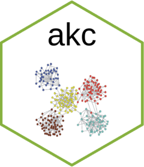

# akc: Automatic knowledge classification 
[](https://cran.r-project.org/package=akc)   [](/commits/master)

Short for automatic knowledge classification, *akc* is an R package used to carry out keyword classification based on network science (mainly community detection techniques), using bibliometric data. However, these provided functions are general, and could be extended to solve other tasks in text mining as well.   

## Features

Generally provides a tidy framework of data manipulation supported by *dplyr*, *akc* was written in data.table when necessary to guarantee the performance for big data analysis. Meanwhile, *akc* also utilizes the state-of-the-art text mining functions provided by *stringr*,*tidytext*,*textstem* and network analysis functions provided by *igraph*,*tidygraph* and *ggraph*. Pipe %>% has been exported from *magrittr* and could be used directly in *akc*.


## Installation

```R
install.packages("akc")
# or
devtools::install_github("hope-data-science/akc")
```

Note: As `akc` utilizes many state-of-the-art functions from various excellent R packages, it might take a while to install the whole suite, especially when you are still not a heavy R user (then lots of packages might not be installed in advance). Nevertheless, the patience pays off. The well-organized framework will save you much more time afterward. 

## Further information

See [vignette](<https://hope-data-science.github.io/akc/articles/akc_vignette.html>).
